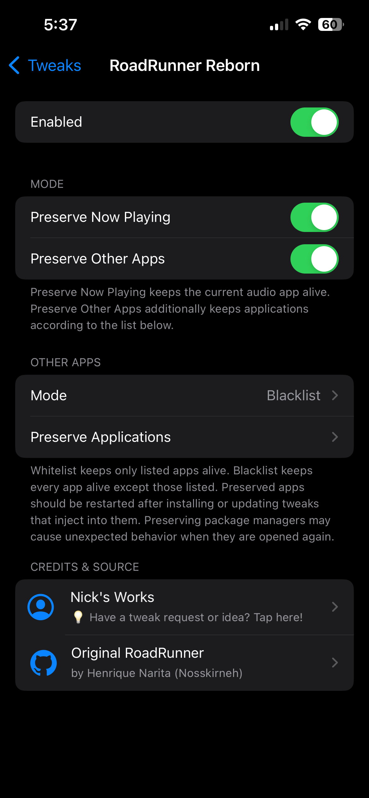

<h1 align="center">RoadRunner Reborn</h1>

<p align="center">
  Keep Now Playing and other apps alive through `sbreload` and resprings!
</p>

<p align="center">
  
  
  
</p>

RoadRunner Reborn is a revival of the original
[RoadRunner](https://github.com/Nosskirneh/RoadRunner) tweak, which keeps the
current Now Playing application, and optionally user-defined applications on a
whitelist/blacklist alive through `sbreload` and SpringBoard resprings.

## Compatibility

**Tested on:**

- iPhone 13 Pro Max, iOS 15.4.1 (rootless)
- iPhone 14 Pro Max, iOS 16.4 (rootless)
- iPhone 13 Pro, iOS 17.1.1 (rootless)

RoadRunner Reborn should(?) work on iOS 18 and newer, let me know!

## Screenshots

<p align="center">
  <a href="assets/Screenshot.png">
    
  </a>
</p>

## Install

Releasing on Havoc repo soon^tm
For now, [you can add my repo at (hadobedo.github.io/repo)](sileo://hadobedo.github.io/repo), or install the latest package matching your jailbreak from below:

- [Releases](https://github.com/hadobedo/RoadRunnerReborn/releases)

Dependencies:

- ElleKit
- PreferenceLoader
- AltList (`com.opa334.altlist`)

## Repository structure

| Path | Purpose |
|---|---|
| `Tweak.xm` | SpringBoard entry and media eligibility hook |
| `RRRRunningBoard.xm` | RunningBoard termination boundary |
| `RRRSpringBoard.xm` | Media tracking, survivor restoration, and FrontBoard reattachment |
| `RRRPreferences.*` | Validated settings and live notification handling |
| `RRRState.*` | Persistent Now Playing state |
| `RRRSurvivors.*` | Generation-stamped root and hosted-child records |
| `Preferences/` | PreferenceLoader and AltList settings bundle |
| `layout/` | Package scripts, including Sileo userspace-reboot handling |
| `vendor/` | Project-owned AltList linker metadata and public header |
| `scripts/` | Package validation, feed publication, and depiction generation |
| `.github/workflows/` | Build, development-feed, and release automation |
| `RoadRunner/` | Local-only upstream reference checkout; not shipped |

## Build

Install [Theos](https://theos.dev). For RootHide builds, use the
[RootHide Theos fork](https://github.com/roothide/theos).

### Rootless

```sh
THEOS=/path/to/theos \
make clean package \
  THEOS_PACKAGE_SCHEME=rootless \
  ARCHS="arm64 arm64e" \
  FINALPACKAGE=1 \
  PACKAGE_VERSION=1.0.0
```

### RootHide

```sh
THEOS=/path/to/roothide-theos \
make clean package \
  THEOS_PACKAGE_SCHEME=roothide \
  ARCHS="arm64e" \
  FINALPACKAGE=1 \
  PACKAGE_VERSION=1.0.0
```

## License and credits

RoadRunner Reborn is licensed under the [GNU GPL-3.0](LICENSE).

- Based on the original [RoadRunner](https://github.com/Nosskirneh/RoadRunner)
  by Nosskirneh.
- [AltList](https://github.com/opa334/AltList) by opa334.
- README formatting inspired by
  [NextUp 3](https://github.com/Yves000/NextUp3/).

